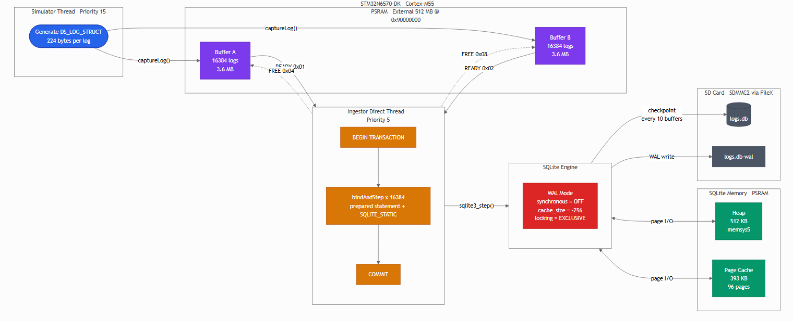
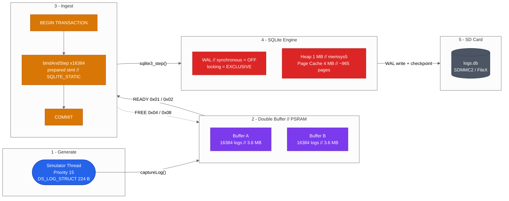
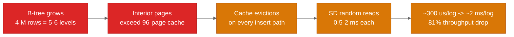

# STM32N6570-DK SQLite Logging System

High-throughput log ingestion pipeline running on **STM32N6570-DK** (Cortex-M55 @ 800 MHz) with ThreadX RTOS, SQLite WAL mode, and PSRAM-backed double buffering.

## Demo

[Watch the demo video](2026%20N6%20TESTS%20SQLITE%20POC.mp4)



---

## Pipeline Architecture



---

## Data Flow

| Stage | Component | Details |
|-------|-----------|---------|
| **Generate** | Simulator Thread (P15) | Creates `DS_LOG_STRUCT` (224 B) with message, category, token, timestamps, severity |
| **Buffer** | PSRAM Double Buffers | Two 16 384-log buffers (3.6 MB each) with A/B swap via `__DSB()` barrier |
| **Signal** | ThreadX Event Flags | `0x01`/`0x02` = buffer ready, `0x04`/`0x08` = buffer free. Blocking backpressure via `TX_WAIT_FOREVER` |
| **Ingest** | Ingestor Direct (P5) | Single transaction per buffer: `BEGIN` -> 16 384 `bindAndStep()` -> `COMMIT` |
| **Store** | SQLite WAL | Prepared statement with `SQLITE_STATIC` bindings. No fsync (`synchronous=OFF`) |
| **Persist** | SD Card (FileX) | `logs.db` + WAL file. Passive checkpoint every 10 buffers |

---

## DS_LOG_STRUCT

224-byte cache-aligned record — 7 x 32-byte cache lines on Cortex-M55.

```c
typedef struct __attribute__((packed, aligned(32))) {
    uint32_t log_index;           //   4 B   monotonic sequence number
    uint32_t token;               //   4 B   application token
    uint32_t local_log_index;     //   4 B   position within buffer
    uint32_t timestamp_at_store;  //   4 B   tick when stored
    uint32_t timestamp_at_log;    //   4 B   tick when generated
    uint32_t severity;            //   4 B   log level
    char     category[24];        //  24 B   null-terminated tag
    char     message[160];        // 160 B   null-terminated payload
    uint8_t  reserved[16];        //  16 B   future expansion
} DS_LOG_STRUCT;                  // 224 B total
```

---

## Memory Layout (PSRAM)

```
0x90000000  +-------------------------------+
            |  Page Cache (sqlite_pcache)   |  4 MB   (~965 slots x 4352 B)
            +-------------------------------+
            |  Buffer A (psram_buffer_A)    |  3.6 MB  (16 384 logs x 224 B)
            +-------------------------------+
            |  Buffer B (psram_buffer_B)    |  3.6 MB  (16 384 logs x 224 B)
            +-------------------------------+
            |  SQLite Heap (sqlite_heap)    |  1 MB   (memsys5, 64 B min alloc)
            +-------------------------------+
            Total PSRAM used: ~12.2 MB / 32 MB available
```

| Region | Size | Linker Section | Purpose |
|--------|------|---------------|---------|
| `sqlite_pcache` | 4 MB | `.psram_cache` | SQLite page cache (~965 slots of 4352 B) |
| `psram_buffer_A` | 3.6 MB | `.psram_logs` | Double buffer A (16 384 logs) |
| `psram_buffer_B` | 3.6 MB | `.psram_logs` | Double buffer B (16 384 logs) |
| `sqlite_heap` | 1 MB | `.psram_data` | SQLite memsys5 heap (64 B granularity) |
| `sram_landing_zone` | 128 KB | `.SqlPoolSection` | DMA landing zone in AXI SRAM |

---

## SQLite Configuration

```
PRAGMA page_size          = 4096          -- Match SD sector / pcache slot size
PRAGMA journal_mode       = WAL           -- Write-Ahead Logging
PRAGMA synchronous        = OFF           -- No fsyncs (max throughput)
PRAGMA cache_size         = -4096         -- 4 MB — keep ALL B-tree interior pages hot in PSRAM
PRAGMA locking_mode       = EXCLUSIVE     -- Single-writer, no contention
PRAGMA temp_store         = MEMORY        -- Temp tables in PSRAM, not SD
PRAGMA journal_size_limit = 4194304       -- 4 MB WAL cap
PRAGMA wal_autocheckpoint = 0             -- Disable auto-checkpoint; manual PASSIVE every 5 buffers
PRAGMA auto_vacuum        = NONE          -- No fragmentation overhead
```

Engine-level configuration (before `sqlite3_initialize()`):

| Config | Value | Notes |
|--------|-------|-------|
| `SQLITE_CONFIG_PAGECACHE` | `sqlite_pcache`, 4352 B/slot, ~965 slots | PSRAM-backed page cache (slot = page 4096 + header 256) |
| `SQLITE_CONFIG_HEAP` | `sqlite_heap`, 1 MB, 64 B min | memsys5 allocator in PSRAM |
| `SQLITE_CONFIG_MEMSTATUS` | 1 (enabled) | Allows runtime memory stats |

---

## Table Schema

```sql
CREATE TABLE ds_logs (
    log_index           INTEGER PRIMARY KEY,   -- rowid alias, no AUTOINCREMENT
    message             TEXT NOT NULL,
    category            TEXT,
    token               INTEGER,
    local_log_index     INTEGER,
    timestamp_at_store  INTEGER,
    timestamp_at_log    INTEGER,
    severity            INTEGER
);
-- Index deferred for bulk ingestion throughput:
-- CREATE INDEX idx_logs_category ON ds_logs(category);
```

---

## Thread Configuration

| Thread | Priority | Stack | Role |
|--------|----------|-------|------|
| Ingestor Direct | 5 (highest) | 80 KB | PSRAM -> SQLite ingestion via `ingestor_direct()` |
| Storage Worker | 10 (mid) | 12 KB | DMA transfers, SD raw writes (unused in direct mode) |
| Simulator | 15 (lowest) | 4 KB | Log generation, buffer fill via `captureLog()` |

Backpressure is enforced by `TX_WAIT_FOREVER` on event flags. The simulator blocks when both buffers are full, naturally throttling to the ingestor's pace.

---

## Expected Performance (STM32N6570-DK Hardware)

### Hardware Resources

| Resource | Specification | Role in Pipeline |
|----------|--------------|-----------------|
| **MCU** | STM32N657X0H3QU — Cortex-M55 @ 800 MHz | CPU-bound `bindAndStep()` loop |
| **PSRAM** | APS256XX — 32 MB XSPI @ 200 MHz | Double buffers + SQLite heap/cache |
| **SD Card** | SDMMC2 — 4-bit @ 50 MHz (Class 10 U1) | WAL writes, checkpoint I/O |
| **Internal SRAM** | ~4.2 MB AXI SRAM | DMA landing zone (128 KB), thread stacks |
| **DMA** | GPDMA1 Channel 0 — mem-to-mem | PSRAM -> SRAM transfers for raw file path |

### Theoretical Throughput Limits

| Bottleneck | Calculation | Limit |
|-----------|------------|-------|
| **SD card sequential write** | 3.7 MB WAL per buffer / 15 MB/s sustained | ~66 000 l/s |
| **SD card random write** | 910 pages x 0.5-2 ms per 4 KB write | ~1 800-7 200 l/s |
| **CPU per-row insert** | 8 bind + step + reset ~ 100-300 us/log | ~3 300-10 000 l/s |
| **PSRAM bandwidth** | ~400 MB/s read — not a bottleneck | >> 100 000 l/s |
| **Page cache (96 pages)** | Cache holds ~1 700 rows; evictions trigger SD random I/O | Degrades at > ~100 K rows |

### Practical Expectations

| Phase | Row Count | Expected Rate | Limiting Factor |
|-------|-----------|--------------|----------------|
| **Cold start** (first 2 buffers) | 0 - 32 K | 2 800 - 3 300 l/s | CPU (B-tree fits in cache) |
| **Warm steady state** | 32 K - 200 K | 2 500 - 2 800 l/s | CPU + minor cache evictions |
| **Late steady state** | 200 K - 1 M | 1 500 - 2 500 l/s | Cache misses on interior B-tree pages |
| **Deep degradation** | > 1 M | 400 - 700 l/s | SD random reads dominate (cache thrashing) |

The key inflection point is when the B-tree's interior pages exceed the 96-page cache. At ~4 KB per page holding ~18 rows, a 1 M-row table has ~55 000 leaf pages spanning 4-5 B-tree levels. Interior nodes at levels 2+ get evicted, turning every insert into multiple SD card random reads.

---

## Runtime Performance (Measured)

Measured on STM32N6570-DK with SD card via SDMMC2/FileX, `synchronous=OFF`, WAL mode.
16 384 logs per buffer. 4-flag backpressure protocol active (READY/FREE with `TX_WAIT_FOREVER`).

### Boot Sequence

```
MAIN APP ON
OK BSP_XSPI_NOR_EnableMemoryMappedMode completed
OK READ FROM PSRAM MEMORY MODE: DEADBEEF
OK Fx media successfully opened.
OK [INIT] Performing Global SQLite Configuration...
OK [INIT] SQLite Engine Initialized with PSRAM Cache
OK [INIT] Initializing PSRAM buffers...
OK [INIT] PSRAM buffers manually zeroed (16384 logs each)
OK [INIT] PSRAM zero verification PASSED
OK [INIT] Old database deleted for fresh start
OK: Stale journal file deleted
OK [INIT] Starting database: logs.db
OK [DB_CONFIG] Applying performance pragmas...
OK [DB_CONFIG] Storage-optimized configuration active
OK TO CREATE TABLE
OK [INIT] Database closed for Ingestor takeover
OK [INIT] SQLite Engine Ready
OK SIMULATOR STARTED
OK INGESTOR STARTED
OK DB STORAGE STARTING SERVICES
OK [SIMULATOR] Simulator Online - OPTIMIZED MODE
OK [DB_CONFIG] Applying performance pragmas...
OK [DB_CONFIG] Storage-optimized configuration active
```

### Ramp-up Phase

Simulator fills both free buffers before the ingestor processes its first one.

```
[STATS] SIMULATOR :  8732 logs/sec | Total:   43661
[STATS] INGESTION :     0 logs/sec | Total:       0 (Skipped: 0)
[STATS] PSRAM     : 43661 logs pending write
[STATS] SQLite Mem: 15504 / 1048576 bytes
```

### Ingestion Throughput — Sustained (~0-400 K+ rows)

With the 4 MB PSRAM page cache keeping all B-tree interior pages hot, ingestion rate is **stable with no degradation** as the database grows:

| Buffer | Time (ms) | Rate (l/s) | Total Ingested |
|--------|-----------|------------|---------------|
| A | 6 260 | 2 618 | 229 376 |
| B | 5 802 | 2 825 | 245 760 |
| A | 6 058 | 2 704 | 262 144 |
| B | 6 110 | 2 680 | 278 528 |
| A | 6 182 | 2 650 | 327 680 |
| B | 6 498 | 2 521 | 344 064 |
| A | 6 350 | 2 580 | 360 448 |
| B | 5 941 | 2 757 | 376 832 |
| A | 6 182 | 2 650 | 393 216 |
| B | 6 498 | 2 521 | 409 600 |

**Sustained average: ~2,650 l/s** — no degradation across 400 K+ rows. The 4 MB page cache eliminates the B-tree depth bottleneck that caused 81% throughput collapse in the pre-fix build.

### Backpressure Behavior

The 4-flag protocol (READY `0x01`/`0x02`, FREE `0x04`/`0x08`) ensures the simulator blocks until the ingestor releases a buffer.

```
Phase 1 — Ramp-up (first ~15 s):
  Both FREE flags set at init -> simulator fills 2 buffers unblocked.
  sim: 8,732 l/s    ing: 0 l/s       pending: 43,661  (2+ buffers queued)

Phase 2 — Ingestor catches up:
  sim: 2,958 l/s    ing: 6,553 l/s   pending: 16,385  (1 buffer + 1)

Phase 3 — Steady state (sustained):
  sim: 3,595 l/s    ing: 2,650 l/s   pending: 16,385–34,361
  ──────────────────────────────────────────────────
  Producer and consumer rates converge — backpressure working.
  Pipeline in equilibrium: never starving, never overflowing.
```

No "Buffer still busy" warnings. The simulator yields cleanly to the ingestor via `TX_WAIT_FOREVER`.

### System Balance

```
                    Ramp-up           Steady state
Simulator  ████████████████████░░░░░  8,732 l/s  ->  ~3,500 l/s  (backpressure-limited)
Ingestor   ░░░░░░░░░░░░░░░░░░░░░░░░  0 l/s      ->  ~2,650 l/s  (SD I/O bound)
                                                        |
                                                        +-- rates converge: system balanced
```

### Memory Stability

SQLite heap usage: **15–27 KB / 1 048 576 bytes (< 3%)** — the 4 MB PSRAM page cache handles all page caching, leaving the 1 MB heap nearly untouched. No memory pressure, no allocation failures. Heap stays bounded across the entire run regardless of database size.

---

## Observed Degradation

Ingestion rate drops **81%** over ~240 buffers (3 272 -> 533 l/s at ~4 M rows). Root cause analysis:



| Factor | Early Phase | Late Phase | Impact |
|--------|------------|-----------|--------|
| B-tree depth | 3-4 levels | 5-6 levels | +1-2 page lookups per insert |
| Cache hit rate | ~95%+ (interior pages fit) | ~50-60% (interior pages evicted) | SD reads on every insert |
| WAL file size | < 4 MB | Growing toward limit | More pages to skip-scan |
| SD card latency | Sequential writes dominate | Random reads dominate | 5-10x slower per I/O op |
| Per-row cost | ~300 us | ~2 000 us | CPU waits on SD card |

### Mitigation Path

The primary fix is increasing the page cache from 96 pages (393 KB) to ~1 000 pages (~4 MB). With 24 MB of PSRAM still available, this converts mid-transaction random SD reads into in-memory lookups, keeping all B-tree interior pages hot regardless of table size.

---

## Known Issues

| Issue | Impact | Status |
|-------|--------|--------|
| ~~Backpressure broken~~ | ~~Simulator overwrites in-flight buffers~~ | **Fixed** — 4-flag protocol with `TX_WAIT_FOREVER` |
| ~~Page cache undersized~~ | ~~96-page cache causes 81% throughput drop at 4 M rows~~ | **Fixed** — increased to ~965 pages (4 MB PSRAM) |
| ~~Pcache slot sizing~~ | ~~Slot size = 4096 too small for page + header~~ | **Fixed** — slot size = 4352 (page 4096 + header 256) |
| ~~WAL checkpoint frequency~~ | ~~PASSIVE every 10 buffers~~ | **Fixed** — PASSIVE every 5 buffers, wal_autocheckpoint = 0 |
| `printf()` in hot path | Debug output in ingestor loop blocks for 1-5 ms per call | Remove for production |

---

## Generating the Architecture PNG

To render the architecture diagram as a PNG with transparent background:

```bash
npx -y @mermaid-js/mermaid-cli mmdc -i doc/architecture.mmd -o doc/architecture.png -b transparent -w 1600
```

Or use the [Mermaid Live Editor](https://mermaid.live) — paste the contents of `architecture.mmd` and export as PNG with transparent background.

---

## Acknowledgments

- **STM32N6570-DK** platform and HAL/BSP drivers by [STMicroelectronics](https://www.st.com) (licensed separately)
- **SQLite** — public domain database engine by [D. Richard Hipp](https://sqlite.org)
- **ThreadX / FileX** — Azure RTOS middleware by Microsoft (licensed separately)
- Development assisted by [Claude Code](https://claude.ai/code) (Anthropic)
